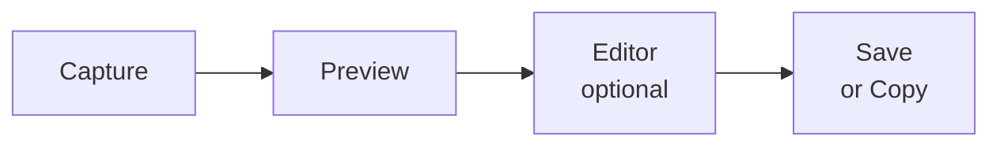
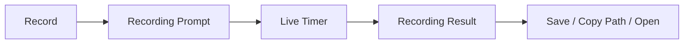

# Jjaeng User Guide

[한국어 가이드](USER_GUIDE.ko.md)

Jjaeng is a preview-first screenshot and recording tool for Wayland + Hyprland. Capture, review, annotate, save, and share — all from the keyboard.

## Demo

<https://github.com/user-attachments/assets/2d2ed794-f86e-4216-b5f1-7dcb513791d4>

---

## Table of Contents

1. [Quick Start](#1-quick-start)
2. [Requirements](#2-requirements)
3. [Installation](#3-installation)
4. [Capture Modes](#4-capture-modes)
5. [Workflow Overview](#5-workflow-overview)
6. [Preview](#6-preview)
7. [Editor](#7-editor)
8. [Editor Tools](#8-editor-tools)
9. [Navigation and Zoom](#9-navigation-and-zoom)
10. [Hyprland Keybinding Setup](#10-hyprland-keybinding-setup)
11. [File Locations](#11-file-locations)
12. [Clipboard Behavior](#12-clipboard-behavior)
13. [Workflow Recipes](#13-workflow-recipes)
14. [Configuration](#14-configuration)
15. [Troubleshooting](#15-troubleshooting)

---

## 1. Quick Start

If you are setting up Jjaeng for the first time:

1. Install Jjaeng and confirm the binary: `which jjaeng`
2. Set up Hyprland keybindings ([Section 10](#10-hyprland-keybinding-setup)).
3. Reload Hyprland: `hyprctl reload`
4. Press `Print` to capture a region. The preview window opens automatically.
5. In Preview: `s` to save, `c` to copy, `e` or `double-click` to open the editor.
6. For recordings, start `jjaeng --record-region-prompt`, use the compact recording bar to pick audio/quality if needed, watch the live timer, then stop and use the recording result window to `Save`, `Copy Path`, or `Open` the finished video.

That's it. The recommended workflow is keybinding-driven — bind capture commands to hotkeys and trigger them directly. Everything else in this guide is optional.

---

## 2. Requirements

**Desktop environment:** Wayland session with Hyprland.

**Runtime dependencies:**

| Command | Package | Purpose |
|---------|---------|---------|
| `hyprctl` | hyprland | Window management queries |
| `grim` | grim | Screen capture |
| `slurp` | slurp | Region / window selection |
| `wl-copy` | wl-clipboard | Clipboard operations |
| `gpu-screen-recorder` or `wl-screenrec` | gpu-screen-recorder / wl-screenrec | Video recording backend |
| `pactl` | pulseaudio / pipewire-pulse | Recording audio source discovery |

**Environment variables:**

| Variable | Required | Purpose |
|----------|----------|---------|
| `HOME` | Yes | Config and save paths |
| `XDG_RUNTIME_DIR` | Recommended | Temp file storage |
| `XDG_CONFIG_HOME` | Optional | Config directory (default: `$HOME/.config`) |

**Optional dependencies:**

| Package | Purpose |
|---------|---------|
| `jjaeng-ocr-models` | OCR text recognition (PaddleOCR v5 model files) |

**Verify everything at once:**

```bash
hyprctl version && grim -h && slurp -h && wl-copy --help && pactl info >/dev/null && (command -v gpu-screen-recorder >/dev/null || command -v wl-screenrec >/dev/null) && echo "All dependencies OK"
```

---

## 3. Installation

### Pre-built binary (GitHub Releases)

Download the latest `x86_64` Linux binary from [GitHub Releases](https://github.com/chllming/Jjaeng/releases):

```bash
curl -LO https://github.com/chllming/Jjaeng/releases/latest/download/jjaeng-x86_64-unknown-linux-gnu.tar.gz
tar xzf jjaeng-x86_64-unknown-linux-gnu.tar.gz
sudo install -Dm755 jjaeng /usr/local/bin/jjaeng
```

### From AUR

```bash
# Source build package
yay -S jjaeng

# Or pre-built binary package (faster, no build dependencies)
yay -S jjaeng-bin

# Optional: install OCR model files for text recognition
yay -S jjaeng-ocr-models
```

### From source

```bash
git clone <repo-url> jjaeng
cd jjaeng
cargo build --release -p jjaeng-cli
# Binary is at target/release/jjaeng
```

### Verify

```bash
jjaeng --version
# Expected: Jjaeng 0.6.0
```

---

## 4. Capture Modes

Jjaeng supports screenshot capture modes, recording modes, and a launchpad mode:

| Flag | Short form | Behavior |
|------|------------|----------|
| `--capture-region` | `--region` | Immediately starts region selection |
| `--capture-window` | `--window` | Immediately starts window selection |
| `--capture-full` | `--full` | Immediately captures the entire screen |
| `--launchpad` | — | Opens the launchpad window (primarily for development) |
| `--version` | `-V` | Print version string (e.g. `Jjaeng 0.6.0`) and exit |
| `--help` | `-h` | Print usage summary and exit |

```bash
jjaeng --region        # Select and capture a region (recommended)
jjaeng --window        # Select and capture a window
jjaeng --full          # Capture full screen
jjaeng --launchpad     # Launchpad UI (primarily for development)
jjaeng --version       # Print version and exit
jjaeng --help          # Print usage and exit
```

Recording commands follow the same pattern:

```bash
jjaeng --record-full
jjaeng --record-region
jjaeng --record-window
jjaeng --record-full-prompt
jjaeng --record-region-prompt
jjaeng --record-window-prompt
jjaeng --stop-recording
```

`--record-*-prompt` opens the compact recording bar first so you can confirm scale, quality, and audio source before capture starts. Press `Esc` before recording begins to cancel both the armed capture area and the recording bar. Plain `--record-*` uses the current defaults immediately, then keeps the same live control bar on screen once recording begins.

The recording bar uses icon controls: target indicator, separate system-audio and microphone toggles with adjacent source dropdown chevrons, scale, quality, live timer, and record / pause / stop actions.

At the moment Jjaeng exposes system audio and microphone as separate controls, but only one audio path can be active at a time with the current recording backend.

Jjaeng uses whichever supported recording backend is available, preferring `gpu-screen-recorder` and falling back to `wl-screenrec`.

During an active recording, the same bar stays visible and shows the live elapsed time. `Esc` stops an active recording from that bar. When you stop, Jjaeng opens a recording result window with a thumbnail plus `Save`, `Copy Path`, `Open`, and `Close` actions for the finished video.

The recommended approach is to bind these commands to Hyprland hotkeys ([Section 10](#10-hyprland-keybinding-setup)) and trigger captures directly from the keyboard. The `--launchpad` mode provides a button-based UI but is mainly intended for development and testing.

`--version` and `--help` exit immediately without launching the GUI or requiring a display server.

If multiple capture flags are given, the last one wins.

---

## 5. Workflow Overview

Jjaeng follows two main flows:





1. **Capture** — take a screenshot (region, window, or full screen).
2. **Preview** — inspect the result. Decide whether to keep, discard, or edit.
3. **Editor** — annotate with arrows, rectangles, text, blur, and more.
4. **Output** — save to file or copy to clipboard.
5. **Record** — start a screen recording with current defaults or from the compact recording bar.
6. **Recording Result** — stop the recording and use the result window to save, copy the video path, or open the finished file.

To revisit prior captures, use `jjaeng --toggle-history` or `jjaeng --open-history`. The history window shows both screenshots and recordings, and double-clicking a screenshot thumbnail opens it in the editor.

Recordings are persisted into history first, so if you close the result window you can still reopen the video from history later. The `Save` action copies the video into your configured recording directory, which defaults to `~/Videos/`.

---

## 6. Preview

Preview is a confirmation step before saving or editing.

### Keyboard Shortcuts

| Key | Action |
|-----|--------|
| `s` | Save to file |
| `c` | Copy to clipboard |
| `e` | Open editor |
| `o` | OCR — extract text from entire image and copy to clipboard |
| `Delete` | Discard capture |
| `Esc` | Close preview |

Preview is a useful safety gate: verify the capture content before committing to save or edit.

### Mouse Interactions

- Single-click the preview to focus it and keep preview shortcuts active on that window.
- Double-click the preview image to open the editor for that capture.
- Preview windows open as compact surfaces near the lower-left edge of the active monitor so they stay out of the way of the main workspace.

### Recording Result Window

When a recording stops successfully, Jjaeng opens a separate result window for the finished video.

The result actions are shown as lightweight icon controls, but they map to the same behavior:

| Action | Behavior |
|--------|----------|
| `Save` | Copies the recording into the configured video output directory (`~/Videos/` by default) |
| `Copy Path` | Copies the current video file path to the clipboard, usually the history copy until you save elsewhere |
| `Open` | Opens the recording in the system default video player |
| `Close` | Dismisses the result window and leaves the recording in history |

Keyboard shortcuts on the recording result window:

| Key | Action |
|-----|--------|
| `s` | Save recording, then close the result window |
| `c` | Copy the current recording path, then close the result window |
| `o` | Open the recording |
| `Esc` | Close the result window |

If the recording was already persisted automatically, the result window still opens so you can copy the path or open the file immediately.

---

## 7. Editor

### General Shortcuts

| Shortcut | Action |
|----------|--------|
| `Ctrl+S` | Save output image |
| `Ctrl+C` | Copy to clipboard |
| `Ctrl+Z` | Undo |
| `Ctrl+Shift+Z` | Redo |
| `Delete` / `Backspace` | Delete selected object |
| `Tab` | Toggle tool options panel |
| `Esc` | Return to Select tool, or close editor if already in Select |

### Tool Shortcuts

| Key | Tool |
|-----|------|
| `v` | Select |
| `h` | Pan |
| `b` | Blur |
| `p` | Pen |
| `a` | Arrow |
| `r` | Rectangle |
| `c` | Crop |
| `t` | Text |
| `o` | OCR |

---

## 8. Editor Tools

### Select (`v`)

- Click an object to select it. Drag to move, use handles to resize.
- Drag on empty canvas to create a selection box.
- `Delete` removes the selected object.

### Pan (`h` or hold `Space`)

- Hold the pan key and drag to move the viewport.
- Works as a temporary modifier: hold `Space` while using any tool to pan without switching tools.

### Blur (`b`)

- Drag to define a blur region.
- **Options:** intensity (1–100, default: 55).
- Blur regions can be resized after placement.
- Very small or zero-area drags are ignored.

### Pen (`p`)

- Drag to draw freehand strokes.
- **Options:** color, opacity (1–100%), thickness (1–255).
- Settings persist across strokes within the session.

### Arrow (`a`)

- Drag from start to end to draw a directional arrow.
- **Options:** color, thickness (1–255), head size (1–255).

### Rectangle (`r`)

- Drag to create a rectangle.
- **Options:** color, thickness (1–255), fill (on/off), corner radius.
- Can be outline-only or filled.

### Crop (`c`)

- Drag to define the crop region. The crop is applied at render time (save/copy), not destructively.
- **Aspect ratio presets:** Free, 16:9, 1:1, 9:16, Original (matches canvas ratio).
- Minimum crop size: 16×16 pixels.
- `Esc` cancels the crop and returns to Select.

### Text (`t`)

- Click to create a text box. Double-click existing text to edit.
- **Options:** color, size (1–255), weight (100–1000), font family (Sans / Serif).
- Text editing keys:

| Key | Action |
|-----|--------|
| `Enter` / `Shift+Enter` | New line |
| `Ctrl+Enter` | Commit text |
| `Ctrl+C` | Copy selected text |
| Arrow keys | Move cursor |
| `Backspace` | Delete character |
| `Esc` | Exit text editing |

### OCR (`o`)

- Drag to define a region, then text is recognized and copied to clipboard.
- In Preview, press `o` to extract text from the entire image.
- Recognized text is automatically copied to clipboard with a toast notification.
- Requires `jjaeng-ocr-models` package (PaddleOCR v5 model files).
- Language is auto-detected from system `LANG` environment variable. Override via `ocr_language` in `config.json` ([Section 14.3](#143-configjson)).
- Supported languages: Korean (`ko`), English (`en`), Chinese (`zh`), Latin, Cyrillic (`ru`), Arabic (`ar`), Thai (`th`), Greek (`el`), Devanagari (`hi`), Tamil (`ta`), Telugu (`te`).

### Tool Options Panel

Press `Tab` to toggle the options panel. This panel exposes configurable properties for the active tool (color, thickness, opacity, etc.). Color palette, stroke width presets, and text size presets can be customized via `theme.json` ([Section 14.1](#141-themejson)).

---

## 9. Navigation and Zoom

Default editor navigation (customizable via `keybindings.json`):

| Action | Default Shortcut |
|--------|------------------|
| Pan | Hold `Space` + drag |
| Zoom in | `Ctrl++`, `Ctrl+=`, `Ctrl+KP_Add` |
| Zoom out | `Ctrl+-`, `Ctrl+_`, `Ctrl+KP_Subtract` |
| Actual size (100%) | `Ctrl+0`, `Ctrl+KP_0` |
| Fit to view | `Shift+1` |
| Scroll zoom | `Ctrl` + scroll wheel |

---

## 10. Hyprland Keybinding Setup

This section connects Jjaeng to your Hyprland hotkeys. For most users, this is the only setup needed after installation.

### 10.1 Check binary path

```bash
which jjaeng
```

- AUR install: typically `/usr/bin/jjaeng`
- Cargo install: typically `~/.cargo/bin/jjaeng`

### 10.2 Create a dedicated config file

Keep Jjaeng bindings in their own file so your main config stays clean.

Add this line once to `~/.config/hypr/hyprland.conf`:

```conf
source = ~/.config/hypr/jjaeng.conf
```

### 10.3 Recommended preset (Print key)

Copy this into `~/.config/hypr/jjaeng.conf`:

```conf
# Jjaeng screenshot bindings (Print-based)
unbind = , Print
unbind = SHIFT, Print
unbind = CTRL, Print
bindd = , Print, Jjaeng region capture, exec, /usr/bin/jjaeng --capture-region
bindd = SHIFT, Print, Jjaeng window capture, exec, /usr/bin/jjaeng --capture-window
bindd = CTRL, Print, Jjaeng full capture, exec, /usr/bin/jjaeng --capture-full
```

> Replace `/usr/bin/jjaeng` with your actual path if different. The `unbind` lines prevent conflicts with existing bindings.

**Or generate it automatically:**

```bash
JJAENG_BIN="$(command -v jjaeng)"
mkdir -p "$HOME/.config/hypr"
cat > "$HOME/.config/hypr/jjaeng.conf" <<EOF
unbind = , Print
unbind = SHIFT, Print
unbind = CTRL, Print
bindd = , Print, Jjaeng region capture, exec, ${JJAENG_BIN} --capture-region
bindd = SHIFT, Print, Jjaeng window capture, exec, ${JJAENG_BIN} --capture-window
bindd = CTRL, Print, Jjaeng full capture, exec, ${JJAENG_BIN} --capture-full
EOF
```

### 10.4 My setup

I'm used to the macOS screenshot shortcuts (`⌥⇧3`/`⌥⇧4`), so I recreated a similar layout on Hyprland. `code:11`–`code:13` are the keycodes for the `2`/`3`/`4` keys:

```conf
# Chalkak screenshot bindings (Option = ALT)
unbind = ALT SHIFT, 2
unbind = ALT SHIFT, 3
unbind = ALT SHIFT, 4
bindd = ALT SHIFT, code:11, Chalkak region capture, exec, jjaeng --capture-region
bindd = ALT SHIFT, code:12, Chalkak window capture, exec, jjaeng --capture-window
bindd = ALT SHIFT, code:13, Chalkak full capture, exec, jjaeng --capture-full
```

> `code:N` binds by keycode in Hyprland, locking to the physical key position regardless of keyboard layout. Useful if you switch between layouts.

### 10.5 Alternative presets

<details>
<summary>Alt+Shift + mnemonic letters (R/W/F)</summary>

```conf
unbind = ALT SHIFT, R
unbind = ALT SHIFT, W
unbind = ALT SHIFT, F
bindd = ALT SHIFT, R, Jjaeng region capture, exec, /usr/bin/jjaeng --capture-region
bindd = ALT SHIFT, W, Jjaeng window capture, exec, /usr/bin/jjaeng --capture-window
bindd = ALT SHIFT, F, Jjaeng full capture, exec, /usr/bin/jjaeng --capture-full
```
</details>

<details>
<summary>Alt+Shift + number row (2/3/4)</summary>

```conf
unbind = ALT SHIFT, 2
unbind = ALT SHIFT, 3
unbind = ALT SHIFT, 4
bindd = ALT SHIFT, 2, Jjaeng region capture, exec, /usr/bin/jjaeng --capture-region
bindd = ALT SHIFT, 3, Jjaeng window capture, exec, /usr/bin/jjaeng --capture-window
bindd = ALT SHIFT, 4, Jjaeng full capture, exec, /usr/bin/jjaeng --capture-full
```
</details>

<details>
<summary>Minimal (region only)</summary>

```conf
unbind = , Print
bindd = , Print, Jjaeng region capture, exec, /usr/bin/jjaeng --capture-region
```
</details>

### 10.6 Reload and verify

```bash
hyprctl reload
hyprctl binds -j | jq -r '.[] | select(.description|test("Jjaeng")) | [.description,.arg] | @tsv'
```

If you see `Jjaeng ... capture` entries with the correct path, bindings are active.

### 10.7 Omarchy users

If you use Omarchy, ensure `source = ~/.config/hypr/jjaeng.conf` is loaded within your Hyprland config chain. If you manage config via symlinked dotfiles, edit the link target. If keybindings stopped working after switching from Cargo to AUR install, check for stale paths in your bindings.

---

## 11. File Locations

| Type | Path | Example |
|------|------|---------|
| Temp captures | `$XDG_RUNTIME_DIR/` (fallback: `/tmp/jjaeng/`) | `capture_<id>.png` |
| Temp recordings | `$XDG_RUNTIME_DIR/` (fallback: `/tmp/jjaeng/`) | `recording_<id>.mp4` |
| Recording history videos | `$XDG_STATE_HOME/jjaeng/history/videos/` (fallback: `$HOME/.local/state/jjaeng/history/videos/`) | `recording-1739698252000000000.mp4` |
| Recording thumbnails | `$XDG_CACHE_HOME/jjaeng/thumbnails/` (fallback: `$HOME/.cache/jjaeng/thumbnails/`) | `recording-1739698252000000000.png` |
| Saved screenshots | `$HOME/Pictures/` | `capture-1739698252000000000.png` |
| Saved recordings | `$HOME/Videos/` | `recording-1739698252000000000.mp4` |
| Config directory | `$XDG_CONFIG_HOME/jjaeng/` (fallback: `$HOME/.config/jjaeng/`) | `theme.json`, `keybindings.json` |

Jjaeng creates these directories automatically when needed.

**Temp file cleanup:** Jjaeng removes screenshot temp files when you close or delete a preview. Recording temp files are cleaned up after the finished video is persisted into history, or kept long enough for the recording result window to finish `Save`, `Copy Path`, or `Open`. Jjaeng also prunes stale `capture_*.png` files (older than 24 hours) at startup.

---

## 12. Clipboard Behavior

Jjaeng copies to the clipboard via `wl-copy`. The MIME type depends on the file being copied:

| File type | MIME type | Content | Used by |
|-----------|-----------|---------|---------|
| PNG image | `image/png` | Raw PNG image bytes | Image editors, browsers, chat apps, coding agents |
| Other files | `text/plain;charset=utf-8` | Absolute file path (UTF-8) | Text editors, terminals, file managers |

For screenshot captures (which are always PNG), image-aware apps receive the raw image data directly — no intermediate file path is needed. This means you can paste screenshots into browsers, chat apps, and coding agents immediately.

---

## 13. Workflow Recipes

### Quick one-shot capture

```
Print → select region → c (copy to clipboard)
```

Two keystrokes and a mouse drag — screen to clipboard.

### Documentation screenshot with annotations

```
Shift+Print → e (editor) → r (rectangle) / a (arrow) / t (text) → Ctrl+S (save)
```

### Privacy-safe sharing (blur sensitive info)

```
Ctrl+Print → e (editor) → b (blur) → drag over sensitive areas → Ctrl+C (copy)
```

### Extract text from a screenshot (OCR)

```
Print → select region → e (editor) → o (OCR tool) → drag over text → copied to clipboard
```

Or from preview for the entire image:

```
Print → select region → o (OCR) → copied to clipboard
```

### Feed context to a coding agent

```
Print → select region → c (copy) → paste into Claude Code / Codex CLI
```

Many coding agents accept clipboard images directly. Jjaeng copies PNG bytes to the clipboard, so paste works without saving to a file first.

### Record and hand off a clip

```
jjaeng --record-region-prompt → Choose source / quality → Record → Stop → Copy Path / Open
```

Use the recording bar when you want to confirm audio source or quality first, then use the recording result window to hand off the video immediately after stop.

---

## 14. Configuration

Jjaeng works without any configuration files. All settings below are optional overrides.

**Config directory:** `$XDG_CONFIG_HOME/jjaeng/` (default: `~/.config/jjaeng/`)

### 14.1 `theme.json`

Controls theme mode, UI colors, and editor defaults.

**Minimal example** (just set theme mode):

```json
{
  "mode": "system"
}
```

`mode` values: `system`, `light`, `dark`. When set to `system`, Jjaeng follows your desktop theme preference, falling back to dark mode if detection fails.

If Omarchy is installed, Jjaeng loads the active Omarchy palette and menu style as its base runtime theme. `theme.json` overrides are applied on top of that base, so you only need to specify values you want to change.

**Full example** with `common` defaults and per-mode overrides:

```json
{
  "mode": "system",
  "colors": {
    "common": {
      "focus_ring_color": "#8cc2ff",
      "border_color": "#2e3a46",
      "text_color": "#e7edf5"
    },
    "dark": {
      "panel_background": "#10151b",
      "canvas_background": "#0b0f14",
      "accent_gradient": "linear-gradient(135deg, #6aa3ff, #8ee3ff)",
      "accent_text_color": "#07121f"
    },
    "light": {
      "panel_background": "#f7fafc",
      "canvas_background": "#ffffff",
      "accent_gradient": "linear-gradient(135deg, #3b82f6, #67e8f9)",
      "accent_text_color": "#0f172a"
    }
  },
  "editor": {
    "common": {
      "rectangle_border_radius": 10,
      "default_tool_color": "#ff6b6b",
      "default_text_size": 18,
      "default_stroke_width": 3,
      "tool_color_palette": ["#ff6b6b", "#ffd166", "#3a86ff", "#06d6a0"],
      "stroke_width_presets": [2, 4, 8, 12],
      "text_size_presets": [14, 18, 24, 32]
    },
    "dark": {
      "default_tool_color": "#f4f4f5"
    },
    "light": {
      "default_tool_color": "#18181b"
    }
  }
}
```

**Merge order:** built-in defaults → `common` → current mode (`dark` or `light`). Every field is optional; missing keys use built-in defaults.

#### Color keys (`colors.common` / `colors.dark` / `colors.light`)

`focus_ring_color`, `focus_ring_glow`, `border_color`, `panel_background`, `canvas_background`, `text_color`, `accent_gradient`, `accent_text_color`

#### Editor keys (`editor.common` / `editor.dark` / `editor.light`)

| Key | Type | Notes |
|-----|------|-------|
| `rectangle_border_radius` | number | Default corner radius for rectangles |
| `default_tool_color` | string | `#RRGGBB` or `RRGGBB` |
| `default_text_size` | number | 1–255 |
| `default_stroke_width` | number | 1–255 |
| `tool_color_palette` | array | Up to 6 items, strict `#RRGGBB` format |
| `stroke_width_presets` | array | Up to 6 items, range 1–64 |
| `text_size_presets` | array | Up to 6 items, range 8–160 |
| `selection_drag_fill_color` | string | `#RRGGBB` or `#RRGGBBAA` |
| `selection_drag_stroke_color` | string | `#RRGGBB` or `#RRGGBBAA` |
| `selection_outline_color` | string | `#RRGGBB` or `#RRGGBBAA` |
| `selection_handle_color` | string | `#RRGGBB` or `#RRGGBBAA` |
Invalid values are ignored with a warning in logs.

#### Legacy compatibility

The older flat schema (`editor` at top level + `editor_modes.dark/light`) is still supported. When both schemas are present, precedence is: `editor` (flat) → `editor.common` → `editor_modes.<mode>` → `editor.<mode>`.

### 14.2 `keybindings.json`

Overrides editor navigation defaults. If this file is missing, built-in defaults are used.

```json
{
  "editor_navigation": {
    "pan_hold_key": "space",
    "zoom_scroll_modifier": "control",
    "zoom_in_shortcuts": ["ctrl+plus", "ctrl+equal", "ctrl+kp_add"],
    "zoom_out_shortcuts": ["ctrl+minus", "ctrl+underscore", "ctrl+kp_subtract"],
    "actual_size_shortcuts": ["ctrl+0", "ctrl+kp_0"],
    "fit_shortcuts": ["shift+1"]
  }
}
```

**Notes:**

- `zoom_scroll_modifier` values: `none`, `control`, `shift`, `alt`, `super`.
- Key name aliases are normalized: `ctrl`/`control`, `cmd`/`command`/`win` → `super`, `option` → `alt`.
- Each shortcut chord must have exactly one non-modifier key (e.g., `ctrl+plus`).
- Shortcut arrays must not be empty.
- If parsing fails, Jjaeng logs a warning and falls back to defaults.

**Validate after editing:**

```bash
jq empty "${XDG_CONFIG_HOME:-$HOME/.config}/jjaeng/keybindings.json"
```

### 14.3 `config.json`

Application-level settings. If this file is missing, built-in defaults are used.

```json
{
  "ocr_language": "korean",
  "recording_dir": "/home/user/Videos",
  "recording_target": "region",
  "recording_size": "native",
  "recording_encoding_preset": "standard",
  "recording_audio_mode": "desktop"
}
```

#### `ocr_language`

Overrides the OCR recognition language. If omitted, Jjaeng auto-detects from the system `LANG` environment variable.

| Value | Language |
|-------|----------|
| `korean` / `ko` | Korean |
| `en` / `english` | English |
| `chinese` / `zh` / `ch` | Chinese |
| `latin` | Latin script languages |
| `cyrillic` / `ru` / `uk` / `be` | Cyrillic script languages |
| `arabic` / `ar` | Arabic |
| `th` / `thai` | Thai |
| `el` / `greek` | Greek |
| `devanagari` / `hi` | Devanagari script languages |
| `ta` / `tamil` | Tamil |
| `te` / `telugu` | Telugu |

#### Recording defaults

`config.json` can also store recording defaults:

| Key | Purpose | Default |
|-----|---------|---------|
| `recording_dir` | Save location used by the recording result window `Save` action | `$HOME/Videos/` |
| `recording_target` | Default target for direct-start recordings | `fullscreen` |
| `recording_size` | Default scale preset | `native` |
| `recording_encoding_preset` | Default quality preset | `standard` |
| `recording_audio_mode` | Default audio input mode | `off` |
| `recording_system_device` | Preferred system-audio source name | auto-detected |
| `recording_mic_device` | Preferred microphone source name | auto-detected |

---

## 15. Troubleshooting

### Capture does not start

| Check | Fix |
|-------|-----|
| Missing dependency | Run the verification command from [Section 2](#2-requirements) |
| Not in Hyprland session | Ensure `HYPRLAND_INSTANCE_SIGNATURE` is set: `echo $HYPRLAND_INSTANCE_SIGNATURE` |
| slurp selection cancelled | Retry with `jjaeng --region` and complete the selection |

### Clipboard copy fails

| Check | Fix |
|-------|-----|
| `wl-copy` not found | Install `wl-clipboard` package |
| Copy returns empty | Verify you are in a live Wayland GUI session (not SSH or TTY) |

### Save fails

| Check | Fix |
|-------|-----|
| `HOME` not set | Set `HOME` environment variable |
| No write permission | Check permissions on `~/Pictures`: `ls -ld ~/Pictures` |

### Recording finishes but no video is saved where expected

| Check | Fix |
|-------|-----|
| Looking for a screenshot-style preview | Recordings open in a dedicated result window, not the screenshot preview |
| Looking in `~/Videos` before pressing `Save` | Finished recordings are written to history first under `$XDG_STATE_HOME/jjaeng/history/videos/` (fallback: `~/.local/state/jjaeng/history/videos/`) |
| Closed the result window immediately | Reopen the recording from `jjaeng --open-history` or `jjaeng --toggle-history` |
| `~/Videos` missing | Check the recording output directory and permissions: `ls -ld ~/Videos` |

### Recording does not start

| Check | Fix |
|-------|-----|
| No supported recorder installed | Install `gpu-screen-recorder` or `wl-screenrec` |
| Audio source dropdowns are empty | Ensure `pactl` works in your session: `pactl info` |
| Recorder exits immediately | Try `gpu-screen-recorder` first on systems where `wl-screenrec` fails to negotiate a capture format |

### OCR not working

| Check | Fix |
|-------|-----|
| "Model files not found" toast | Install `jjaeng-ocr-models` package, or place model files in `~/.local/share/jjaeng/models/` |
| Wrong language recognized | Set `ocr_language` in `config.json` ([Section 14.3](#143-configjson)) or check system `LANG` |
| "No text found" on valid text | Try a larger selection area; very small or low-contrast text may not be detected |

### Temp files accumulate

Jjaeng cleans up temp files automatically on close/delete and prunes stale files at startup. If files still accumulate:

1. Ensure `XDG_RUNTIME_DIR` is set (avoids `/tmp/jjaeng/` fallback).
2. Close previews/editors normally instead of force-killing.
3. Manual cleanup: `rm $XDG_RUNTIME_DIR/capture_*.png` (or `/tmp/jjaeng/capture_*.png`).
